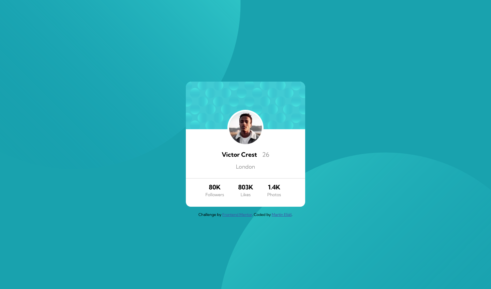
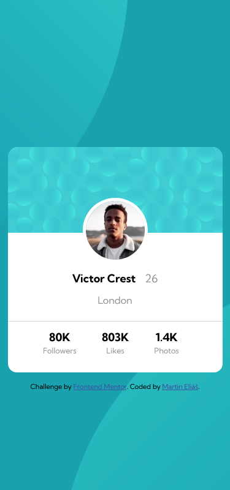

# Frontend Mentor - Profile card component solution

This is a solution to the [Profile card component challenge on Frontend Mentor](https://www.frontendmentor.io/challenges/profile-card-component-cfArpWshJ). Frontend Mentor challenges help you improve your coding skills by building realistic projects. 

## Table of contents

- [Overview](#overview)
  - [The challenge](#the-challenge)
  - [Screenshots](#screenshot)
  - [Links](#links)
- [My process](#my-process)
  - [Built with](#built-with)
  - [What I learned](#what-i-learned)
  - [Continued development](#continued-development)
- [Author](#author)

## Overview

### The challenge

- Build out the project to the designs provided

### Screenshots

### Links

- Solution URL: [https://github.com/smradupan/profile-card-component-main](https://github.com/smradupan/profile-card-component-main)
- Live Site URL: [Add live site URL here](https://your-live-site-url.com)

## My process

I had some issues at start, working with .svg as background.

### Built with

- Semantic HTML5 markup
- CSS custom properties
- Flexbox

### What I learned

I learned how to deploy .svg as background and positioning it. 

### Continued development

I will now focuse on more complex assignments.

## Author

- Frontend Mentor - [@smradupan](https://www.frontendmentor.io/profile/smradupan)
- LinkedIn - [@martineliáš](https://www.linkedin.com/in/martin-eli%C3%A1%C5%A1-455550209/)

